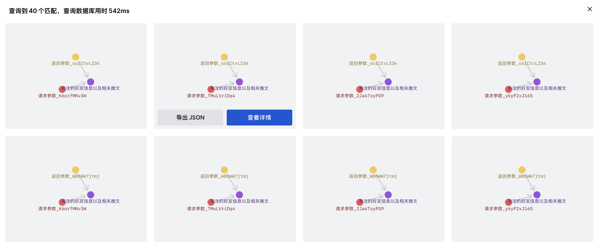

# Ideograph Editor for Iframe Embedding

## Configure

可以通过修改 `static/databaseConfiguration.json` 下的内容控制显示的数据库名字（没有其他作用）。



iframe 查看详情时会向上层窗口 postMessage，成员的类型声明可见 `src/services/PatternSolution.ts`，导出 JSON 和 postMessage 的内容是相同的。

```ts
export namespace Solution {
    export type MessageType = {
        pattern: Solution.Pattern;
        data: Solution.PatternSolution;
    }
}
```


## Build

#### 打包
```shell
npm run build
```

#### 后处理
```shell
kotlin post-process.kts
```
后处理用于去除 html 内多余的斜杠，并把 `static/databaseConfiguration.json` 复制到打包的文件夹内。

或者使用 `npm run build!` 一次性完成上面两个命令。

打包时如果遇到依赖的类型声明报错可以尝试将 `.d.ts` 内的错误类型全删掉或 `npm run build -f`。


